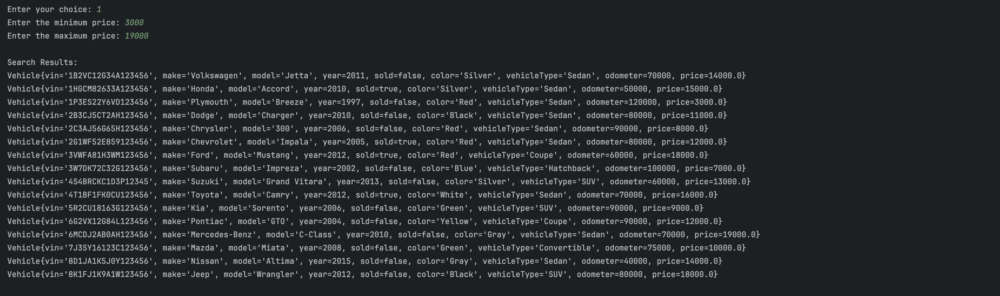
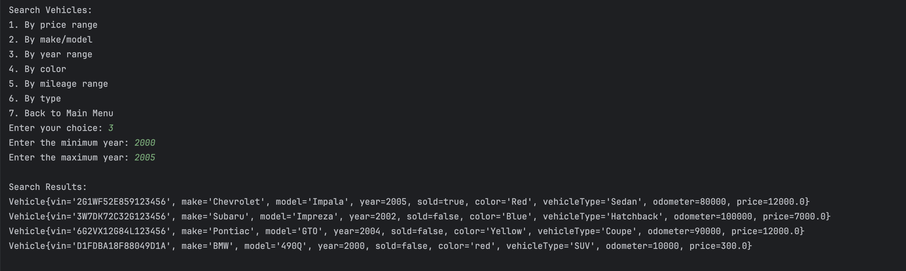
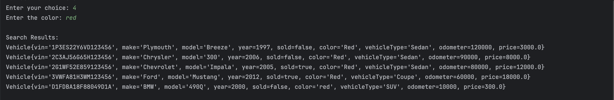
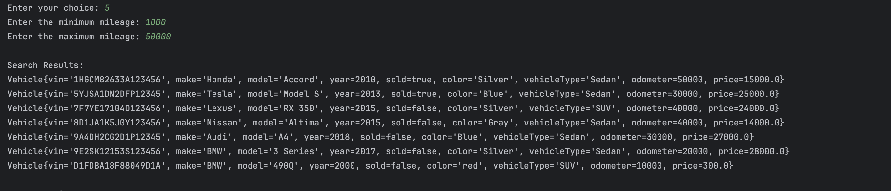
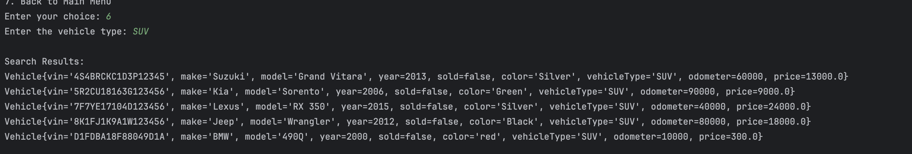
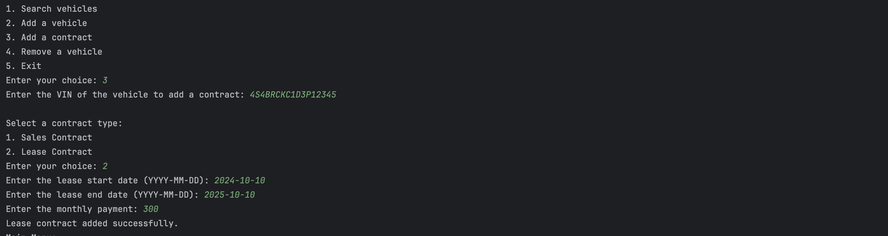
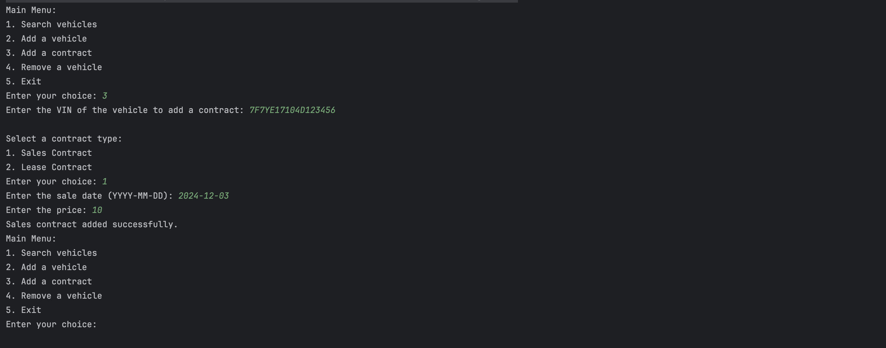
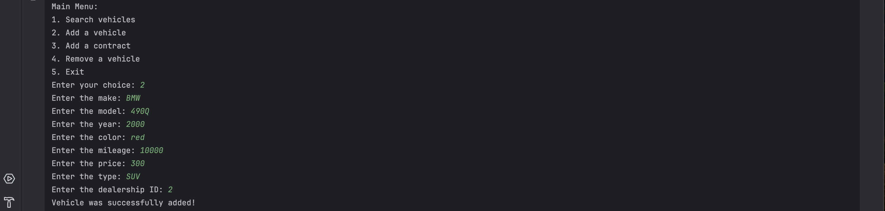
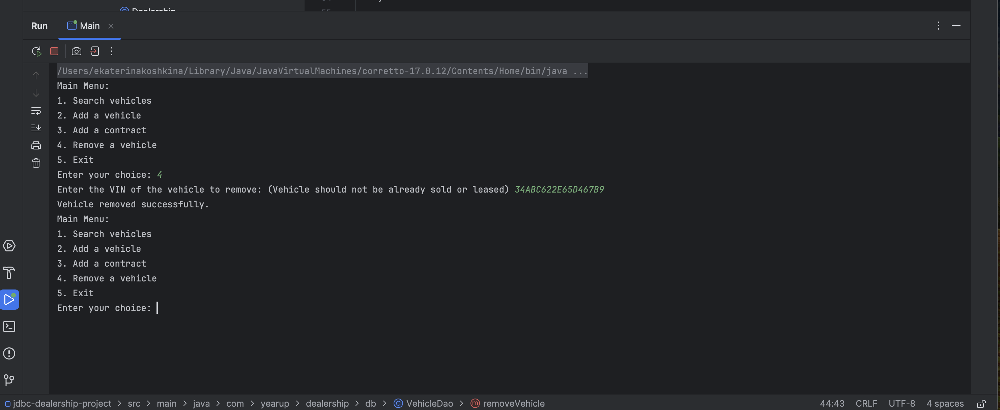

# DB dealership project

## Description of the Project

This Java console application is designed to streamline the management of a car dealership. The application allows users to perform a variety of tasks, such as searching for vehicles, adding new vehicles to inventory, creating sales or lease contracts, and removing vehicles. This tool is intended for both dealership staff and backend administrators who need a seamless way to manage inventory and contracts. The application's purpose is to simplify inventory and contract management, ensure accurate processing, and provide a clear record of all actions.

## User Stories

- As a user, I want to have an option to search for vehicles by criteria like price range, make, model, year, color, mileage, and type so that I can easily find the vehicles I am interested in.
- As a manager, I want the ability to add new vehicles to inventory so that the database stays up-to-date with the dealership’s offerings.
- As a manager, I want to create sales contracts by entering details like VIN, sale date, and price so that transactions are properly recorded.
## Setup

Instructions on how to set up and run the project using IntelliJ IDEA.

### Prerequisites

- IntelliJ IDEA: Ensure you have IntelliJ IDEA installed, which you can download from [here](https://www.jetbrains.com/idea/download/).
- Java SDK: Make sure Java SDK is installed and configured in IntelliJ.
- MySQL Workbench: Ensure you have MySQL Workbench installed for database setup and management.

### Running the Application in IntelliJ

Follow these steps to get your application running within IntelliJ IDEA:

1. Open IntelliJ IDEA.
2. Select "Open" and navigate to the directory where you cloned or downloaded the project.
3. After the project opens, wait for IntelliJ to index the files and set up the project.
4. Find the main class with the `public static void main(String[] args)` method.
5. Right-click on the file and select 'Run 'YourMainClassName.main()'' to start the application.

## Technologies Used

- Java: Version 17
- IntelliJ IDEA: For development and execution.
- MySQL: For database management
- Raymond's Skeleton Code: Provided foundational structure for the project

## Demo of the project

**Search By Price Range**

**Search By Make and Model**

**Search By Year Range**

**Search By Color**

**Search By Mileage Range**

**Search By Type**

**Lease Contract**

**Sales Contract**

**Add Vehicles**

**Remove Vehicles**

## Future Work

Outline potential future enhancements or functionalities you might consider adding:

- GUI Implementation: Expand the console-based application into a graphical user interface.

## Thank you

I would like to express my gratitude to Raymond for providing the foundational skeleton code that greatly assisted in the development of this project. 
